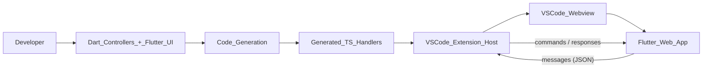

> **Historical (v0) document.** This PRD describes the original
> webview/TypeScript product, which required author-side npm and
> TypeScript. It is retained for history only and contradicts the current
> non-negotiable 100%-Dart boundary; the current product is defined by
> [the vision](specs/vision/vision.md) and the [README](README.md).

### 1. Product Summary

`flutter_vscode` is a Flutter package that lets developers build VS Code extensions using **Flutter for the UI** and **Dart for the business logic**, instead of writing all UI and wiring by hand in TypeScript and raw webviews. It provides annotations, code generation, and tooling that automatically generate the VS Code extension scaffolding, TypeScript handlers, and a webview-ready Flutter web app so that extension authors can focus on product behavior and UI rather than boilerplate.

At a high level, `flutter_vscode` turns a Flutter web app plus annotated Dart controllers into a working VS Code extension. A single CLI command (`generate_vscode_extension`) scaffolds the extension project (TS/Node config, web assets, debug config), and a standard build pipeline (Dart `build_runner`, TypeScript, and `flutter build web`) keeps the Dart and TypeScript sides in sync.

### 2. Problem Statement & Motivation

- **Painful current state of VS Code extension development**
  - Writing extensions typically means working directly in TypeScript/JavaScript, plus manual webview HTML/JS for any rich UI.
  - Webviews are restricted (CSP, blocked remote resources, asset loading rules), and authors must hand-roll the HTML shell, script loading, and communication channel.
  - Logic and models are often duplicated between the extension host (TypeScript) and any embedded web UI, leading to drift and extra maintenance.
  - Flutter teams who are comfortable with Dart and Flutter widgets must context switch into TS + raw DOM/webview patterns when they want a VS Code companion tool.

- **Why Flutter + Dart for VS Code extensions**
  - Many teams already use Flutter for mobile and web; reusing those skills (and in some cases code) for editor tooling can be a big productivity win.
  - Flutter gives a rich, declarative UI toolkit that is often more expressive than hand-rolled HTML/CSS for complex tools and dashboards.
  - By treating the VS Code webview as a Flutter web host and generating the TS glue automatically, we can centralize most logic and domain concepts in Dart.

`flutter_vscode` exists to remove the boilerplate and integration pain of building webview-based VS Code extensions, especially for teams who are already invested in Flutter.

### 3. Target Users & Use Cases

- **Primary users**
  - Flutter developers and teams who want to build VS Code extensions without becoming experts in the VS Code extension/webview stack.
  - Product teams who already have Flutter-based tools or visualizations and want to surface them directly inside VS Code (e.g., project dashboards, configuration panels).
  - Open-source maintainers who want to create editor tooling for their Flutter/Dart packages using a familiar stack.

- **Representative use cases**
  - Custom panels and dashboards (e.g., project health, CI status, analytics, graphs).
  - Workflow helpers (e.g., wizards for common tasks, guided project setup, multi-step forms).
  - Data viewers (e.g., log viewers, JSON explorers, asset browsers) powered by Flutter UI.
  - Companion tools for existing Flutter/Dart libraries (e.g., visual configuration editors, inspectors).

- **Non-goals**
  - Being a generic “host any web app” solution for VS Code webviews without using Flutter or the provided codegen.
  - Replacing all TypeScript-based extensions; the goal is to optimize the path for Flutter + Dart teams, not to cover every extension pattern.
  - Providing backend hosting, synchronization, or cloud infrastructure; this is a client-side framework focused on the extension/webview boundary.

### 4. Product Goals & Non-Goals

- **Goals**
  - **Reduce extension boilerplate**
    A developer should be able to scaffold a new extension project (TS config, `package.json`, `.vscode/launch.json`, `web/` assets, scripts) with a single CLI command and minimal manual edits.
  - **Provide a strongly-typed bridge between Dart and VS Code (TypeScript)**
    Annotations such as `@VSCodeController` and `@VSCodeCommand` should define the API surface once in Dart, and generated Dart + TypeScript code should handle wiring, argument passing, and message routing.
  - **Make webview constraints “just work”**
    Generated web assets (HTML, bootstrap JS, manifest) should comply with VS Code webview CSP and resource loading rules so authors rarely need to think about them.
  - **Offer a predictable build and run workflow**
    A standard pipeline (build_runner → TypeScript compile → `flutter build web`) should be documented, scriptable, and reproducible for all users.
  - **Support maintainable, well-structured code generation**
    Keep generators, runtime utilities, and webview bridges organized and documented so both internal maintainers and external contributors can evolve the framework.

- **Non-goals**
  - Providing opinionated UI kits or design systems beyond what Flutter itself offers.
  - Handling complex multi-process orchestration, remote services, or backends; those are left to extension authors.
  - Automatically migrating existing arbitrary TS-based extensions into Flutter-based ones.

### 5. Core Functionality & Requirements

This section describes what must be true from a user’s perspective, based on current and intended capabilities.

#### 5.1 Annotation-based code generation

- Capabilities
  - Define annotated controller classes in Dart using `@VSCodeController` and command methods using `@VSCodeCommand`.
  - Generate:
    - Dart implementations of these controllers (e.g., `*.vscode.g.part`).
    - Matching TypeScript handlers (e.g., `*.handlers.ts`) that VS Code can call.

- Product-level requirements
  - A developer can:
    - Declare a new command method in a Dart controller, run `dart run build_runner build`, and have that command automatically available in the generated TypeScript handlers.
    - Avoid editing the generated TS files by hand; the intended workflow is “edit Dart + annotations, regenerate.”
  - The generator must:
    - Surface clear, actionable error messages (`InvalidGenerationSourceError`-style) when annotations are misused or types are unsupported.

#### 5.2 Extension scaffolding CLI (`generate_vscode_extension`)

- Capabilities
  - CLI (Dart executable) that:
    - Sets up `.vscode/launch.json` with a ready-to-run extension host configuration.
    - Creates `scripts/compile.sh` that wires together build_runner, TypeScript compilation, and `flutter build web` with appropriate flags (CSP, no remote resources).
    - Creates `src/extension.ts` (from a template or default) as the extension entry point.
    - Creates `lib/vscode_api.dart` as a default controller file demonstrating how to define annotated commands.
    - Generates `package.json`, `tsconfig.json`, and a `web/` folder (HTML, manifest, bootstrap, icons) tailored for VS Code webviews.
    - Updates `.gitignore` with sensible defaults for Node, Flutter, and generated files.

- Product-level requirements
  - A developer can run:
    - `dart run flutter_vscode:generate_vscode_extension` in an empty or existing directory and obtain a working extension skeleton.
  - After running:
    - Running `npm install` and `npm run compile` followed by F5 in VS Code should launch an extension development host with the Flutter webview wired up.
  - The CLI must:
    - Be idempotent where reasonable (e.g., not overwrite user code in `lib/` if not necessary, or at least document what will be overwritten).
    - Print clear success/failure messages and common next steps.

#### 5.3 Bidirectional communication between Flutter app and VS Code

- Capabilities
  - A webview bridge (`VSCodeWebViewHelper`, web implementation + stub) that:
    - Initializes the JS-side VS Code API (`acquireVsCodeApi`) when available.
    - Sends messages from Flutter (Dart) to the extension host via JSON-serialized payloads.
    - Receives messages from the extension host and routes them to Dart handlers.
  - Generated TypeScript handlers that:
    - Register VS Code commands and route them into generated Dart-backed handlers via the webview channel.

- Product-level requirements
  - A Flutter widget in a webview can:
    - Call a Dart method on a generated controller (e.g., `createApiController().showInformationMessage(...)`) and see the corresponding VS Code UI effect (e.g., `window.showInformationMessage`).
  - The system must:
    - Handle absence of the VS Code API gracefully (e.g., running in a browser without `acquireVsCodeApi`) with clear behavior for debugging.
    - Keep message formats stable and documented for maintainability.

#### 5.4 Webview-safe Flutter web configuration and build scripts

- Capabilities
  - Generated `web/index.html`, `flutter_bootstrap.js`, and `manifest.json` configured for:
    - CSP compatibility (e.g., no remote CDN by default, local CanvasKit, disabling history manipulations that conflict with webviews).
    - Asset paths that work correctly within a VS Code extension’s `build/web` directory.
  - `scripts/compile.sh` that:
    - Runs `dart run build_runner build --delete-conflicting-outputs`.
    - Runs `tsc`.
    - Invokes `flutter build web` with flags tuned for VS Code webviews.

- Product-level requirements
  - After running the standard compile script, the extension should:
    - Load the Flutter web app reliably inside the VS Code webview without CSP errors or blocked remote resource loads.
  - Authors should:
    - Rarely need to modify the generated HTML/JS for basic scenarios; advanced customization is possible but not required.

### 6. User Experience & Developer Workflow

#### 6.1 End-to-end developer flow

From a typical user’s perspective, building an extension with `flutter_vscode` should look like:

1. **Set up project**
   - Create a new directory for the extension project.
   - Run `dart run flutter_vscode:generate_vscode_extension`.
   - Run `flutter pub get` and `npm install`.
2. **Define extension API in Dart**
   - Edit `lib/vscode_api.dart` (or create additional files) to declare `@VSCodeController` classes and `@VSCodeCommand` methods.
3. **Build Flutter UI**
   - Create or edit `lib/main.dart` with a Flutter app that uses `VSCodeWebViewHelper.initialize()` and renders the desired UI.
4. **Generate code and build**
   - Run `dart run build_runner build`.
   - Run `npm run compile` (which runs the script to compile TS and Flutter web).
5. **Debug in VS Code**
   - Open the project in VS Code and press F5 to launch the extension development host.
   - Interact with the webview-based Flutter UI and commands.

#### 6.2 Architecture and data flow

Conceptual flow between components:

### 7. Constraints & Assumptions

- **Technical constraints**
  - Must comply with VS Code webview security model:
    - CSP restrictions on scripts, styles, and remote resources.
    - No reliance on remote CDNs for critical assets (e.g., CanvasKit).
  - Flutter web constraints:
    - Built with flags that disable PWA strategies and tree-shaking of icons when those conflict with webviews.
  - Supported environments:
    - Flutter SDK (per `pubspec.yaml` constraints), modern Node/TypeScript versions as configured in the scaffold.
    - VS Code versions compatible with the generated `engines.vscode` range.

- **Assumptions**
  - Users:
    - Are comfortable with Flutter/Dart basics and can run `flutter build web`.
    - Can install Node.js, npm, and TypeScript tooling.
    - Will run `build_runner` as part of their normal development loop.
  - The generated structure is acceptable as a starting point; users may customize beyond it as they gain expertise.

### 8. Metrics & Success Criteria

These are initial, high-level indicators; they can be refined once we have real users and use cases.

- **Adoption & usage**
  - Number of projects (internal or external) using `flutter_vscode` to ship real VS Code extensions.
  - Number and quality of example extensions in the `example/` directory or separate repos.
- **Developer experience**
  - Time from “empty directory” to “first working extension panel” for a Flutter developer who has not seen the framework before (target: under 1 hour after reading the README/PRD).
  - Qualitative feedback that:
    - The scaffolding and build pipeline are understandable and debuggable.
    - Most extension logic can be expressed in Dart without touching TS for common scenarios.
- **Reliability**
  - Low frequency of issues related to webview CSP or build misconfiguration once the project is correctly scaffolded.
  - Stable generated APIs so that upgrades of `flutter_vscode` are not overly disruptive.

### 9. Risks, Open Questions, and Future Directions

- **Risks**
  - **Performance and footprint**: Flutter web apps can be heavier than minimal HTML/JS UIs; some extensions may be sensitive to startup time or memory usage.
  - **Interop maintenance**: Keeping the Dart/TypeScript bridge and VS Code API usage up to date as upstream tools evolve.
  - **Complexity of build pipeline**: Coordinating Dart codegen, TS compilation, and Flutter web builds may be intimidating for some users.

- **Open questions**
  - What long-term versioning strategy do we want for the generated code and annotations to avoid breaking users frequently?
  - How far should we go in supporting advanced scenarios like:
    - Multiple webviews or multi-root workspaces.
    - Deep integration with VS Code APIs (e.g., tree views, terminals, debug adapters) beyond the webview.
  - How opinionated should we be about project layout beyond the basics?

- **Future directions**
  - **Tiered integration testing** (next priority): CI build smoke on `example/`, local extension-host checklist, periodic greenfield regression. See [docs/reference/roadmap.md](docs/reference/roadmap.md).
  - Additional templates and generators (e.g., opinionated starters for dashboards, inspectors, or wizards).
  - Richer tooling around the generator (e.g., validation commands, health checks, code actions).
  - More comprehensive examples and tutorial-style documentation to showcase best practices.
  - Improved debugging and hot-reload experience for Flutter web inside VS Code webviews, as platform constraints allow.

