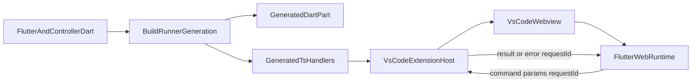

# Architecture

System-level structure for generation, runtime messaging, and extension hosting.

## Components

- **Annotations**
  - `@VSCodeController` and `@VSCodeCommand` define command surface in Dart.
- **Generators**
  - Dart generator emits `*.vscode.g.part`.
  - TypeScript generator emits `*.handlers.ts`.
- **Runtime bridge**
  - `VSCodeControllerBase` posts commands and tracks pending responses.
  - `VSCodeWebViewHelper` receives host messages and routes to runtime.
- **Extension host**
  - `src/extension.ts` registers webview and forwards incoming messages to generated handlers.

## Data Flow

## Key Contracts

- [Dart to VS Code Message Contract](../reference/message-contract.md)
- [PRD Traceability and MVP Acceptance](../reference/prd-traceability.md)

## Related

- [Documentation Index](../index.md)
- [Agent Guidelines](../agent-guidelines/index.md)
