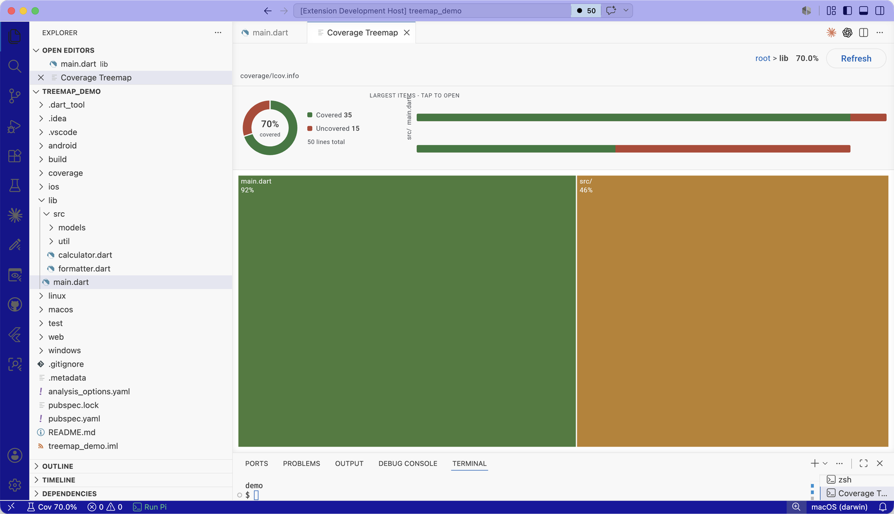
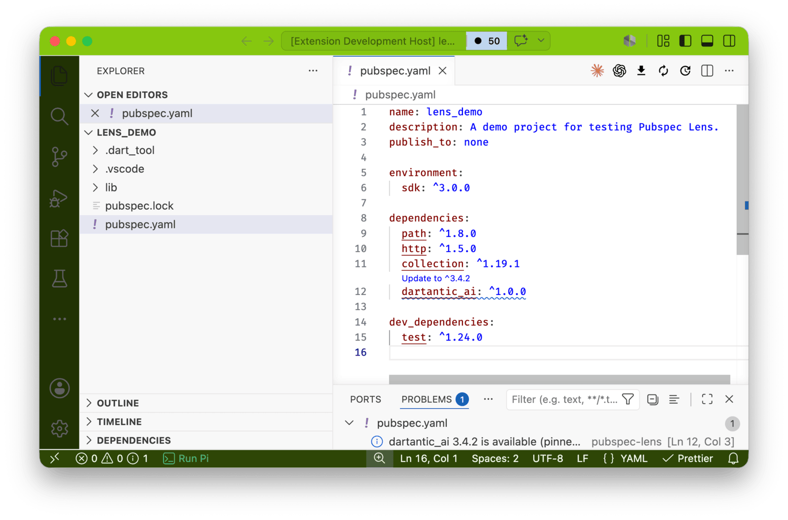

# flutter_vscode

Build VS Code extensions with Dart-owned activation, commands, and providers, plus optional Flutter webviews. Host Dart compiles to JavaScript that runs inside VS Code's Extension Host; generated bindings preserve native VS Code objects and callbacks. You never write, read, or repair TypeScript.

One generated layer reaches the VS Code API: a mechanically generated, complete typed Dart mapping of every public declaration in the pinned VS Code baseline this release ships (1.129.1), with a Dart-first ergonomic surface in the same artifact. The package version *is* the baseline — the layer ships in `package:dart_vscode`, and the release you depend on decides which VS Code API you get.

## Getting started

You need the Dart and Flutter SDKs and VS Code. The CLI is currently unreleased, so activate it from your checkout of this repository:

```sh
dart pub global activate --source path \
  /path/to/flutter_vscode/packages/flutter_vscode
```

Once the package is published to pub.dev, the install command becomes `dart pub global activate flutter_vscode`.

## Your first extension: Dart only

Scaffold a dedicated Extension Project:

```sh
flutter_vscode create my_extension
cd my_extension
```

The scaffold makes runtime boundaries visible:

```text
extension.dart       Dart-owned metadata and contributions
host/                pure Dart Extension Host behavior
shared/              pure Dart package shared across runtimes
views/               optional Flutter webviews (empty for now)
```

`extension.dart` is the source of truth for the extension manifest — name, version, activation events, and contributed commands all live in typed, analyzer-checked Dart:

```dart
import 'package:flutter_vscode/manifest.dart';

const extension = ExtensionManifest(
  name: 'my-extension',
  displayName: 'My Extension',
  description: 'A VS Code extension written in Dart.',
  version: '0.0.1',
  publisher: 'local',
  activationEvents: ['onLanguage:json'],
  commands: [
    ExtensionCommand(
      command: 'my-extension.hello',
      title: 'Say Hello from Dart',
    ),
  ],
);
```

The CLI parses this declaration as data — project code is never executed — while the scaffolded root `pubspec.yaml` gives the author's editor full completion and type-checking over the same constant. Commands are one contribution surface among several: views, view containers, and configuration settings declare the same way — the shipped Pubspec Lens example contributes its dependencies tree and its `registryUrl` setting entirely from `extension.dart`.

The build generates against the one VS Code baseline this release pins, which also fixes the generated `engines.vscode` value. A project does not choose a baseline: depend on the `flutter_vscode` release that ships the API you need, exactly as you would pin any other package. [Moving the Pinned VS Code Baseline](../../docs/guides/new-baseline.md) documents how a maintainer advances it.

Behavior lives in `host/lib/extension.dart`. The scaffold already uses the VS Code API through the generated layer — it registers the contributed command and a hover provider, and hands both registrations to `context.own` (from `package:dart_vscode/host_commands.dart`), which parks them in `context.subscriptions` so VS Code disposes them:

```dart
final context = ExtensionContext(rawContext);
final vscode = VscodeApi(rawVscode);

final hello = (() => helloMessage.toJS).toJS;
context.own(
  vscode.commands.registerCommand(_helloCommand, toHostCallback(hello)),
);

final provider = HoverProvider.lit$(
  provideHover: toHostCallback(provideHover),
);
context.own(
  vscode.languages.registerHoverProvider('json'.toJS, provider),
);
```

Check the toolchain and the project before building:

```sh
flutter_vscode doctor
```

`doctor` writes one `[ok]` or `[!!]` line per check — the Dart and Flutter SDK probes, plus (inside an Extension Project) the layout, the descriptor, and whether `package:dart_vscode` (which carries the pinned VS Code baseline) resolves — and exits nonzero when any check fails.

Build it:

```sh
flutter_vscode build
```

`build` deterministically generates the VS Code manifest (`package.json`), the identity-wiring host modules, the CommonJS bootstrap, the compiled host bundle with its source map, and `.vscode/launch.json` — only what is derived from the project itself; the VS Code API layer ships inside `package:dart_vscode`. It also fails closed: syntax errors, layout violations, and host-forbidden imports (`dart:io`, Flutter, browser-only libraries in `host/` or `shared/`) are reported with actionable error codes.

`flutter_vscode build --watch` keeps that loop running: it rebuilds whenever `extension.dart`, `host/lib`, `shared/lib`, or a view's `lib` changes, reporting failures without exiting. Press Ctrl+C to stop.

### Debug it in a dedicated VS Code instance

Open the project folder in VS Code and press **F5**. The generated launch configuration (`"type": "extensionHost"`) starts a separate Extension Development Host window with your extension loaded — your editing instance stays untouched. In the new window:

1. Open any `.json` file — the `onLanguage:json` activation event fires and your Dart `activate` runs.
2. Run **Say Hello from Dart** from the Command Palette.
3. Hover over the first line of the JSON file — the tooltip `Hover from Dart at 0:…` comes from your Dart hover provider.

The host bundle ships with a source map back to your Dart sources. After any edit, rerun `flutter_vscode build` and restart the debug session (or use **Developer: Reload Window** in the development host).

You can also launch the development host straight from a terminal — no editor session required. Point VS Code at the built extension and any workspace to test against:

```sh
code --new-window \
  --extensionDevelopmentPath="$PWD" \
  /path/to/some/workspace
```

The path must be absolute and the project must be built. Add `--inspect-extensions=<port>` to attach a debugger to the Extension Host, or `--disable-extensions` to keep other installed extensions out of the development host while you test.

### Reaching the rest of the VS Code API

The scaffold registers a command and a hover provider, but the generated layer is complete: it ships as `package:dart_vscode/dart_vscode.dart`, which your host package depends on. Wrap the raw activation module, and every namespace, class, enum, and callback in VS Code 1.129.1 is available with types:

```dart
import 'package:dart_vscode/dart_vscode.dart' as parity;

final api = parity.VscodeApi(rawVscode);

// Native values construct through module-rooted factories.
final uri = api.Uri.file('/tmp/notes.md');
final position = api.Position.new$(0.toJS, 0.toJS);

// Interfaces and options objects are created with lit$ literal factories.
final registration = api.languages.registerHoverProvider(
  parity.DocumentFilter.lit$(language: 'markdown'.toJS),
  parity.HoverProvider.lit$(provideHover: myProvider.toJS),
);

// Overloads keep suffixed names; promises await as Dart futures.
final choice = await api.window
    .showInformationMessage<JSString>(
      'Ship it?'.toJS,
      ['Yes'.toJS, 'Later'.toJS],
    )
    .toDart;
```

Conventions: classes construct through `new$` (statics live on the same object), enums are `int` typedefs with values on `api.<EnumName>`, JS `undefined` and `null` both surface as Dart `null`, and unions erase to their least upper bound with typed `isInstance`/`cast` narrowing helpers. `api.dart` enters the Dart-first surface of the same artifact — `Future` returns, broadcast `Stream` event accessors, plain `String`/`num`/`bool` boundaries. See the [Generated Host API](../../docs/reference/generated-host-api.md) and the [parity report](../../docs/reference/parity.md).

### Test it

```sh
flutter_vscode test
```

`test` runs every suite the project has — `shared/test` and `host/test` with `dart test`, each `views/<name>/test` with `flutter test` — and fails if any suite fails. A fresh scaffold has none yet; the command tells you where to add them.

### Package it

```sh
flutter_vscode package
```

This validates the framework-managed artifacts and writes `build/my-extension-0.0.1.vsix`, installable with VS Code's **Extensions: Install from VSIX…** command.

## Adding a Flutter View

A Flutter View is a Flutter web app hosted inside a VS Code webview panel. Add one under `views/` — a minimal view is a plain Flutter package:

```text
views/main_panel/pubspec.yaml
views/main_panel/lib/main.dart
views/main_panel/web/index.html
```

```yaml
# views/main_panel/pubspec.yaml
name: main_panel
publish_to: none

environment:
  sdk: ^3.12.0

dependencies:
  flutter:
    sdk: flutter
  flutter_vscode:
    path: /path/to/flutter_vscode/packages/flutter_vscode
```

```dart
// views/main_panel/lib/main.dart
import 'package:flutter/widgets.dart';
import 'package:flutter_vscode/view.dart';

void main() => runFlutterView(
      const Directionality(
        textDirection: TextDirection.ltr,
        child: Text('Flutter View ready'),
      ),
    );
```

`runFlutterView` boots the app safely inside a VS Code webview — the document's real origin is `vscode-webview://`, and Flutter's default URL strategy (exercised by `MaterialApp`'s history integration) would otherwise throw a `SecurityError` during engine startup and render nothing. One more webview rule: bundle any fonts you use (declare them under `flutter: fonts:`) — Flutter web fetches its default Roboto and Noto fallbacks from the network at runtime, which the webview CSP blocks.

```html
<!-- views/main_panel/web/index.html -->
<!DOCTYPE html>
<html>
<head>
  <base href="$FLUTTER_BASE_HREF">
  <meta charset="UTF-8">
  <title>Main Panel</title>
</head>
<body>
  <script src="flutter_bootstrap.js" async></script>
</body>
</html>
```

With a view present, `flutter_vscode build` also compiles it with webview-safe settings into `out/views/main_panel/`. The versioned protocol the host and view speak is a shipped library — `package:dart_vscode/view_protocol.dart` — never copied or generated into your project. No Node, npm, or manual web tooling is involved, and `package` bundles the view assets into the VSIX.

### Showing the view from Host Dart

Add a command to `extension.dart`:

```dart
  commands: [
    ExtensionCommand(
      command: 'my-extension.showPanel',
      title: 'Show Flutter Panel',
    ),
  ],
```

Hosting is the framework-owned module `package:dart_vscode/flutter_view_host.dart`, shipped like the rest of the runtime. Opening the view from the command is one call — `FlutterViewHost.open` owns panel creation, resource-root scoping, session identifiers, CSP-correct HTML, and disposal:

```dart
FlutterViewHost? viewHost;
final showPanel = (() {
  viewHost ??= FlutterViewHost.open(
    context: context,
    vscode: vscode,
    viewName: 'main_panel',
    viewType: 'my-extension.mainPanel',
    title: 'Flutter Panel',
    onClosed: () => viewHost = null,
  );
}).toJS;
context.own(
  vscode.commands.registerCommand(
    'my-extension.showPanel',
    toHostCallback(showPanel),
  ),
);
```

Typed view-to-host requests plug into the same call: pass `operations: [myOperation.bind(handler)]` and the view invokes them over the versioned protocol (`ViewOperation` in `package:flutter_vscode/view.dart`). On the view side, `ViewShell.connect` (same library) owns the connected session — typed operation calls, the current VS Code theme with its change stream, host-pushed event streams, and one `dispose` releasing everything the shell created.

`FlutterViewHost` builds on `window.createWebviewPanel` with scripts enabled and resource roots scoped to your built view — VS Code's own webview primitives, surfaced with Dart types. See the [architecture docs](../../docs/architecture/index.md).

### Debugging the Flutter View

Debugging works the same way: `flutter_vscode build`, press **F5**, and run **Show Flutter Panel** in the Extension Development Host — the panel renders your Flutter app. Host-side behavior is debugged exactly as in the Dart-only case. For the view side, run **Developer: Open Webview Developer Tools** in the development host to get the browser console, network, and element inspectors for the Flutter web runtime inside the panel.

## Shipped example extensions

Complete, working extensions built with this workflow live in [`extensions/`](../../extensions/README.md). They double as reference implementations for the patterns above and are held to the same bar as the framework: built only through the CLI, each proven in a real Extension Host by its own gate (`scripts/test_coverage_extension.sh`, `scripts/test_pubspec_lens.sh`).

### Coverage Treemap

Test coverage for any project that produces an `lcov.info` — Host Dart parses the tracefile, paints covered and uncovered lines into the editor, keeps a live percentage in the status bar (click it to run `flutter test --coverage` in a terminal), and pushes fresh snapshots to an interactive Flutter-rendered panel over the view protocol whenever coverage changes: a squarified treemap (tile area = lines of code, color = coverage) with drill-down navigation, plus donut and per-child bar charts built with the pub.dev package `fl_chart` — Flutter-ecosystem code reuse running inside a VS Code webview, themed with VS Code's own colors.



**Pubspec Lens** is the Host-Only counterpart: dependency intelligence for `pubspec.yaml` — hovers, a CodeLens that bumps any constraint trailing the registry, diagnostics for the pins that actually block the latest release, and a dependencies tree — built entirely on VS Code's native UI surface with `pub_semver` and `yaml` doing the semantics and no Flutter View at all. Together the two examples draw the dividing line: native surfaces for lists, text, and annotations; a Flutter View when you need custom drawing.



## Repository validation

Contributors need Flutter, Docker, and a running Docker daemon:

```sh
flutter analyze
./scripts/ci_gates.sh
```

`ci_gates.sh` runs the repository's CI workflow locally, job by job — the checks, test, and gate jobs in runner-like containers, then, on macOS, the desktop job natively: five real-host gates with no container and no xvfb, the platform Extension Authors actually develop on. Four of those gates take `FLUTTER_VSCODE_GATE_NATIVE=1` to run the native variant standalone; the host gate has a dedicated native script, `scripts/test_host_extension_native.sh`. The coverage gate asserts the Flutter View's painted first frame, not just protocol boot.

## Documentation

- [Documentation Index](../../docs/index.md)
- [Quickstart](../../docs/guides/quickstart.md)
- [Architecture](../../docs/architecture/index.md)
- [Generated Host API](../../docs/reference/generated-host-api.md)
- [API Parity Report](../../docs/reference/parity.md)
- [Generated File Ownership](../../docs/guides/generated-file-ownership.md)
- [Agent-Assisted Development](../../docs/guides/agent-assisted-development.md)
